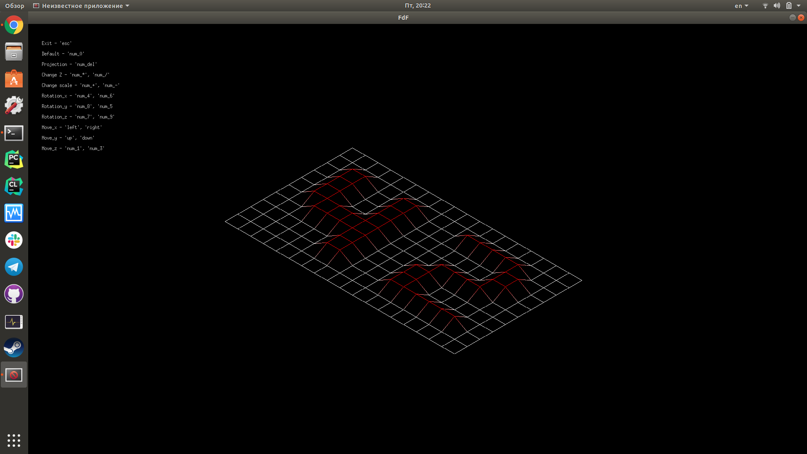
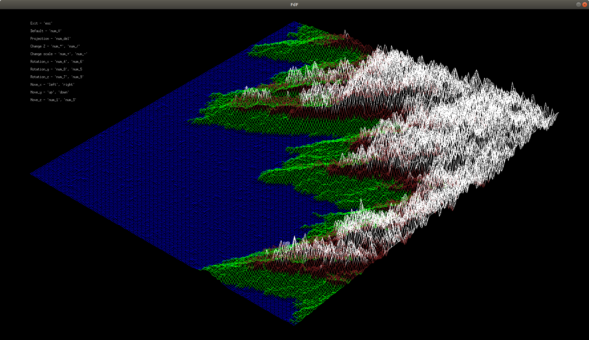
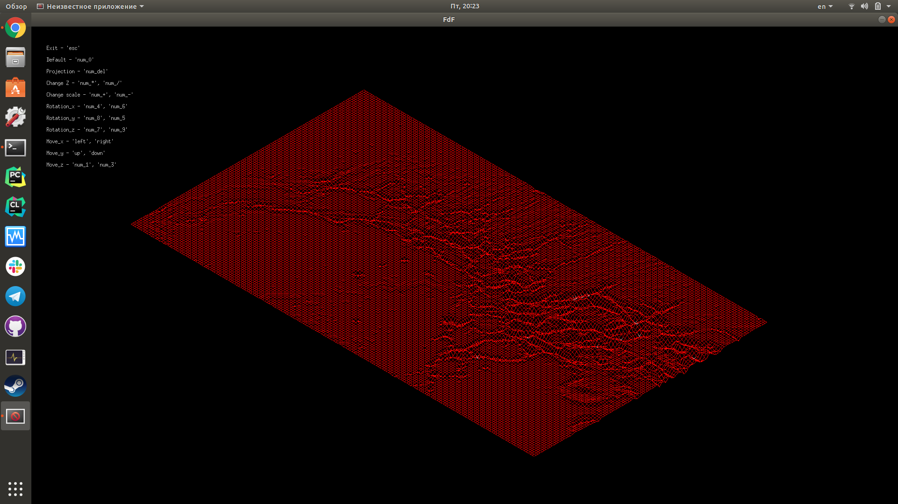
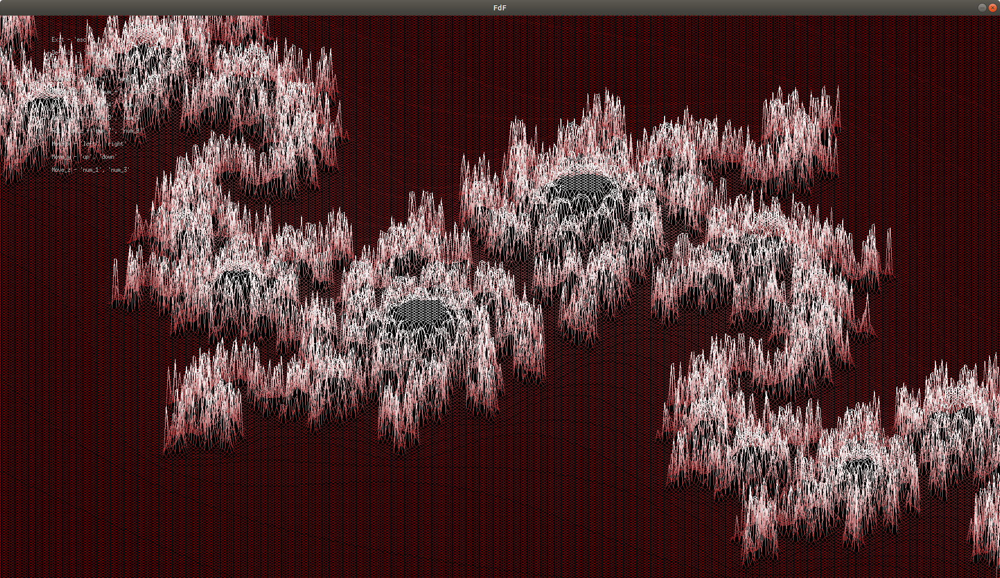

# FdF
Building a map in 3D using "wireframe" graphics (“fils de fer” in french, hence the name of the project).

Install (only for Linux or macOS):
1) Run the "make" command to compile the program.
2) Run the "make clean" command to delete the object files.
3) Run the "make fclean" command to delete the object and executable files.
4) Run the "make re" command to delete the object and executable files, and recompile the program.

  
Run:
1) Run the "./fdf" command, which takes the path to the map file as an argument (examples of maps are in the "test_maps" folder).

Examples:
​
​
​
​
