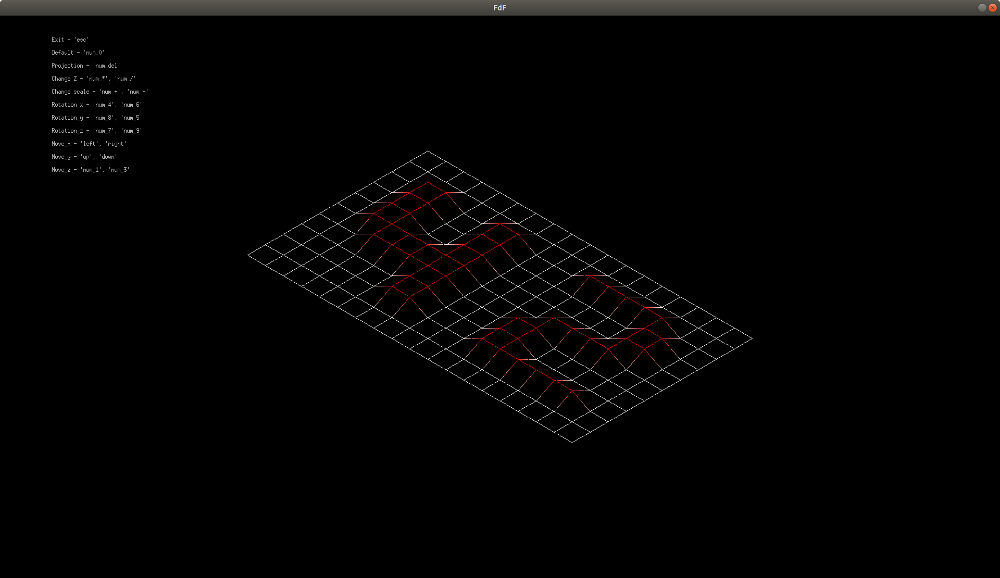
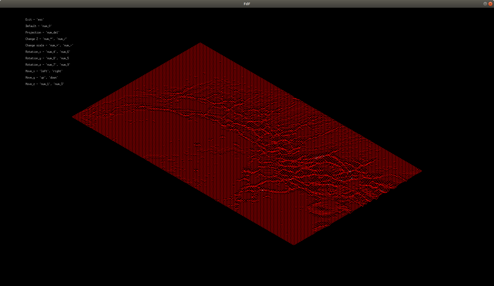

# FdF
Building a map in 3D using "wireframe" graphics (“fils de fer” in french, hence the name of the project).

# Install (only for Linux or macOS)
Run:
```git clone --recursive https://github.com/Dovran-Annakuliev/FdF.git && cd FdF && cd make -s && make clean -s```

# Start
Run: ```./fdf "the path to the file with the map"```
(examples of maps are in the "test_maps" folder)


Examples:
​
​
​
​
